# DIU21
Prácticas Diseño Interfaces de Usuario 2020-21 (Tema: Turismo) 

Grupo: DIU2_CajerosRurales.  Curso: 2020/21 
Updated: 25/3/2021

Enlace a Github: https://github.com/Oscarntnz/DIU21

Proyecto: eatgr

Descripción: Aplicación web basada en el turismo culinaro en Granada, donde los usuarios podrán tanto acceder a la información sobre distintos bares granadinos, como planear una ruta o valorar dichos bares.

Logotipo: 
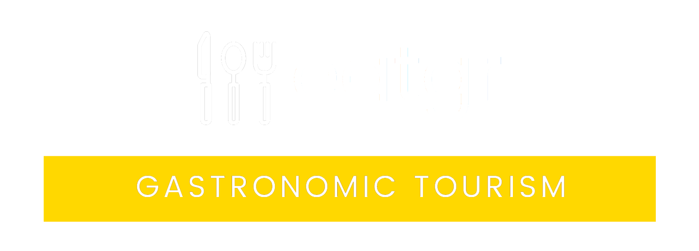

Miembros
 * :bust_in_silhouette:  Óscar Antúnez Martinaitis :octocat:     
 * :bust_in_silhouette:  Miguel Carracedo Rodríguez :octocat:

----- 

# Proceso de Diseño 

## Paso 1. UX Desk Research & Analisis 

 1.a Competitive Analysis
-----

|  Nombre   |Web/App |                               Inconvenientes                                      |Ámbito |
|:---------:|:------:|:---------------------------------------------------------------------------------:|:-----:|
|Granadatur |Web     | Web algo antigua e información un poco escasa en ciertas partes.                  |Turismo|
|EsMadrid   |Web     |Interfaz algo abarrotada.                                                          |Turismo|
|Turismo.gal|Web     |Omisión de información al cambiar de idioma                                        |Turismo|
|Google Maps|Ambas   |Poca explicación sobre como manejarlo                                              |General|
|TurGranada |Ambas   |No hay información sobre preguntas comunes de los usuarios o indicaciones generales|Turismo|

De entre todas las posibles aplicaciones de turismo web , hemos escogido TourGranada debido a que está centrada en turismo en Granada, y posee una versión App, a diferencia de las otras.

 1.b Persona
-----

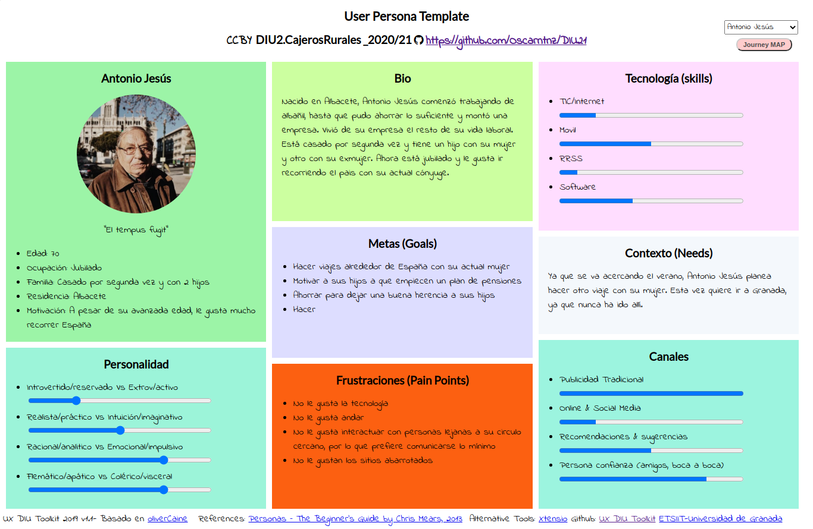

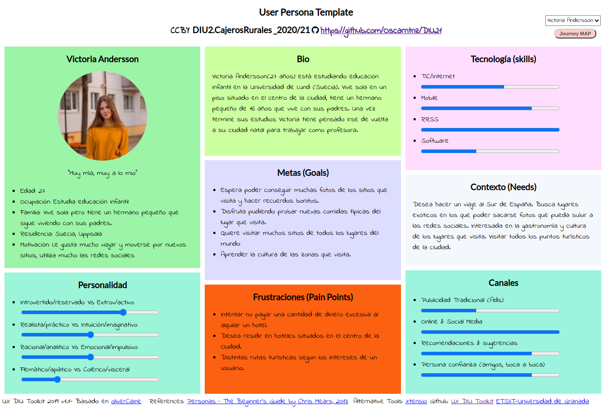

Consideramos que esos dos personas (con poca experiencia con la tecnología y que no habla el idioma de la aplicación) nos podían presentar escenarios donde podriamos comprobar si la aplicación tuviera una interfaz lo suficientemente clara como para ser entendible para esos usuarios.

 1.c User Journey Map
----

Para Antonio Jesús, decidí que hiciera un viaje a Granada, ya que sería capaz de probar todas o la mayoría de funcionalidades de la aplicación, cosa que le podría causar problemas con la interfaz. Respecto a la segunda persona hemos decidido poner la barrera del idioma como inconveniente ya que creemos que es algo muy presente en la actualidad y tanto el anterior como este puede ayudarnos a diseñar una interfaz más enfocada a la facilidad de comprensión y uso por parte del usuario.

 1.d Usability Review
----
- Enlace al documento: https://github.com/Oscarntnz/DIU21/tree/master/P1/Usability-review.xlsx  
- Valoración final: 67 
- Comentario sobre la valoración: Si bien es una aplicación concreta para el turismo en Granada, notamos que era escueta en ciertas funcionalidades, y mejorable en algunos aspectos. Sin embargo es perfectamente usable por usuarios con poca experiencia o con alguna dificultad.

## Paso 2. UX Design  

 2.a Feedback Capture Grid / EMpathy map / POV
----

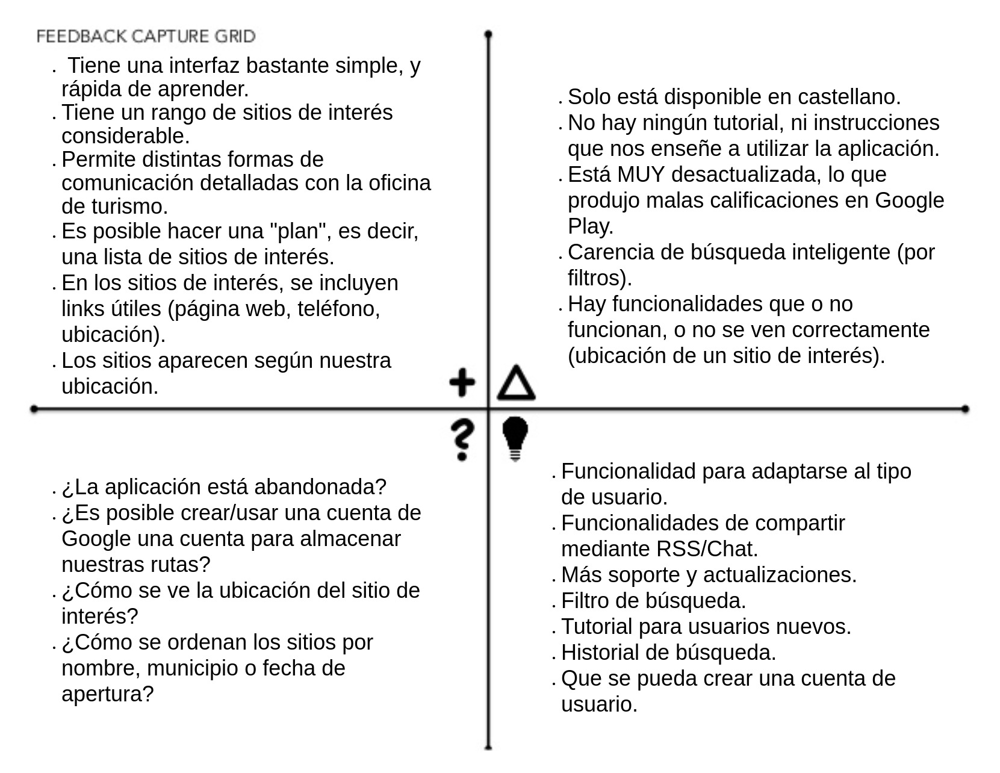

De la apliación TurGranada nos hemos fijado principalmente en que es una aplicación bastante báscia en comparación con sus competidores. Está bastante desactualizada, y lo recogimos todo en la malla. 
    
Nosotros proponemos una aplicacion que esté basada en el turismo gastronomico en Granada, que se pueda usar facilmente tanto por turistas como propietarios de bares. Gracias al análisis anterior a TurGranada, queremos que esta aplicación permita crear cuentas para los usuarios, donde pueda guardar preferencias y rutas; Implemente mejoras de calidad de vida, como un modo oscuro, o que la interfaz esté inspirada en otras de aplicaciones altamente populares; E incentivar el turismo culinario en Granada, sobretodo para gente inexperta.

 2.b ScopeCanvas
----
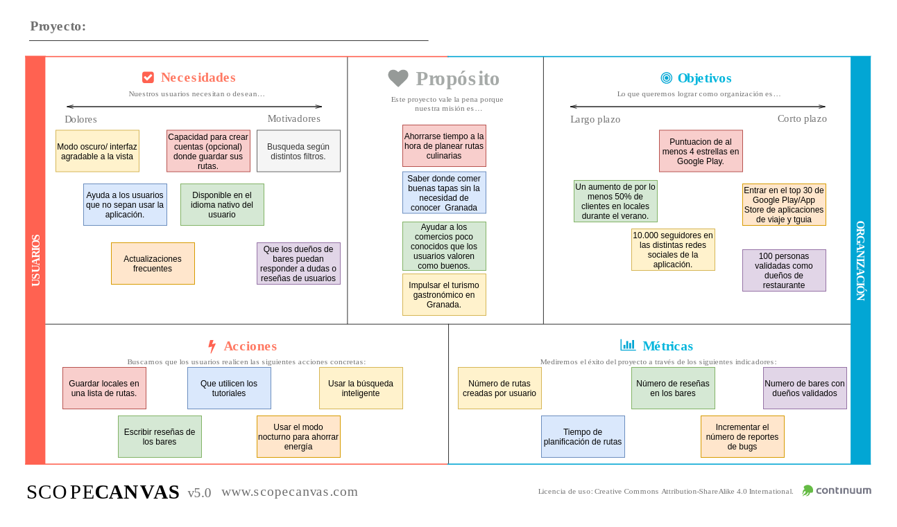

 2.b Tasks analysis 
-----

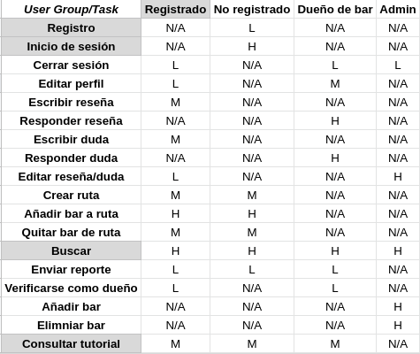

 2.c IA: Sitemap + Labelling 
----

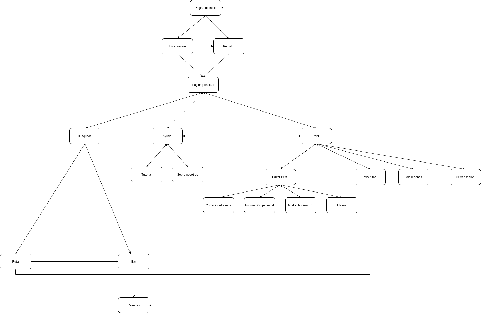

| Label                     | Descripción                                                                                       |            Icono             |
| ------------------------- | ------------------------------------------------------------------------------------------------- | ---------------------------- |
| Página de inicio          | Pagina prinicipal de la aplicación                                                                |       |
| Inicio de Sesión/Registro | Iniciar sesion como usuario o crearse una cuenta en caso de no poseer una                         |    |
| Búsqueda                  | Busqueda de rutas culinarias o bares en granada                                                   |     |
| Ayuda                     | Tutorial, preguntas frecuentes, atención al cliente                                               |      |
| Perfil                    | Perfil de los usuarios registrados en la aplicación (correo electrónico, númerio de teléfono, ..) |     |
| Editar Perfil             | Ajustar los datos personales de los usuarios                                                      ||
| Ruta                      | Rutas gastronómicas mas buscadas y populares                                                      |       |
| Bar                       | Bares recomendados por otros usuarios                                                             |        |
| Borrar Ruta               | Eliminar una ruta guardada por un usuario                                                         |    |
| Añadir Ruta               | Añadir una ruta en la lista de rutas de un usuario                                                |        |
| Cerrar Sesión             | Cerrar sesión como usuario de la aplicación                                                       |     |
| Sobre Nosotros            | Correo electónico, teléfono de atención al cliente                                                |    |
| Tutorial                  | Tutorial con los pasos iniciales para los usuarios mas recientes                                  |   |
| Email                     | Email de un comercio, bar, o persona                                                              |       |
| Teléfono                  | Telefono de contacto                                                                              |       |
| Contacta con nosotros     | Correo electrónico, numero de telefono de la empresa para hacer un reporte                        |     |
| Menu desplegable          | Menu que se despliega                                                                             |       |
| Contraseña                | Contraseña del usuario                                                                            |   |
| Puntuacion                | Puntuación de un bar                                                                              |       |
| Editar                    | Editar la reseña de un bar                                                                        |     |

 2.d Wireframes
-----

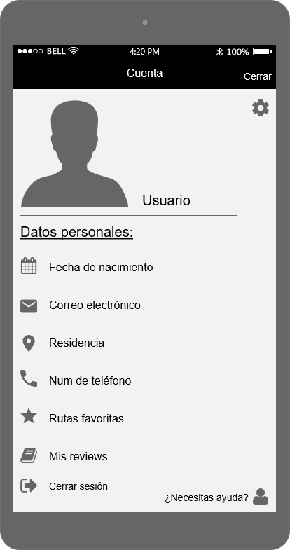
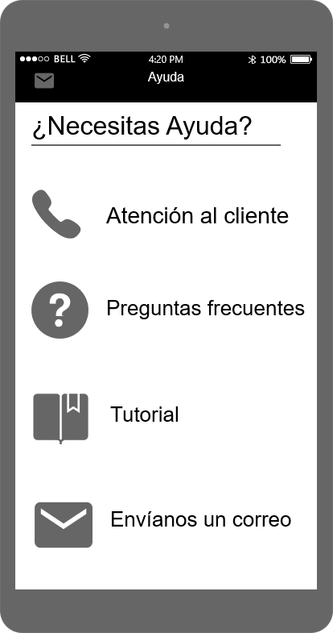
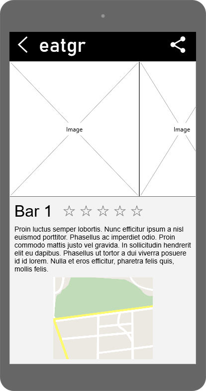
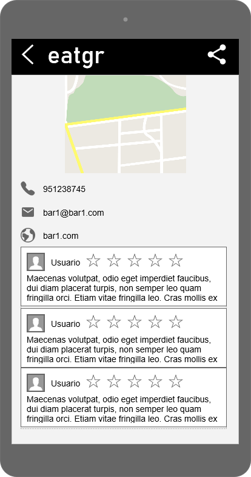
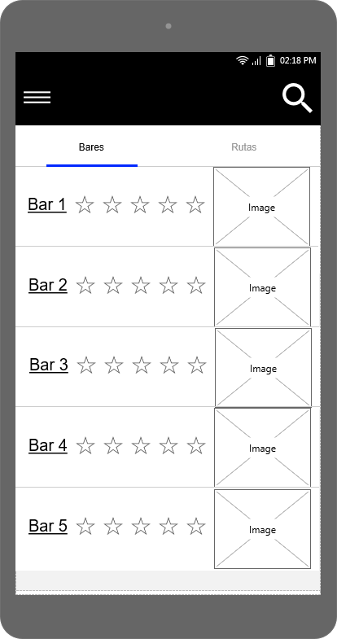
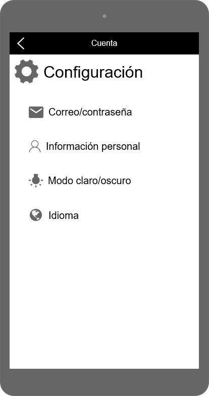
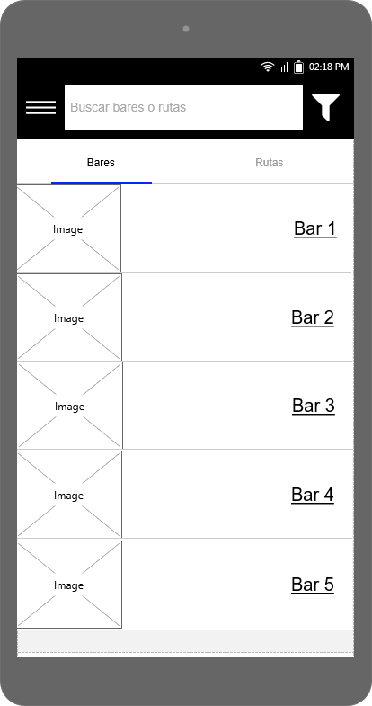
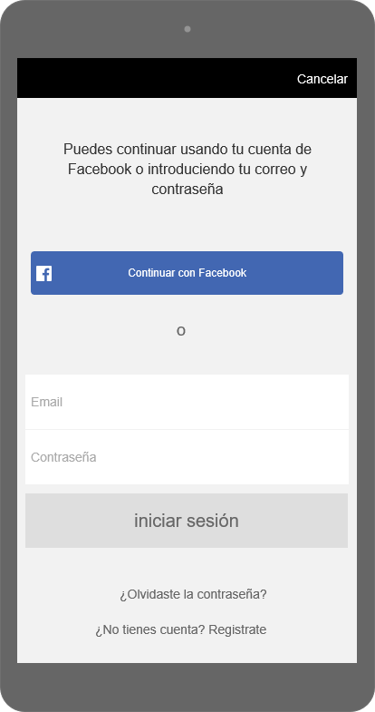
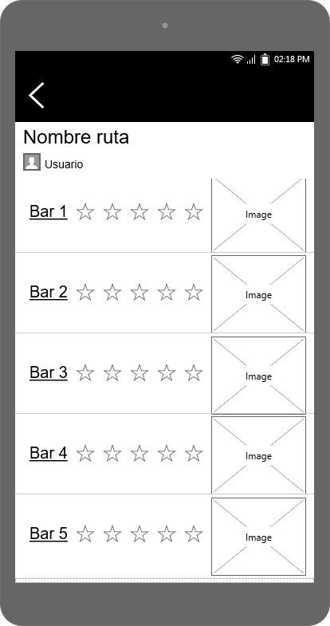

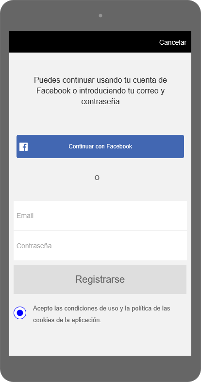
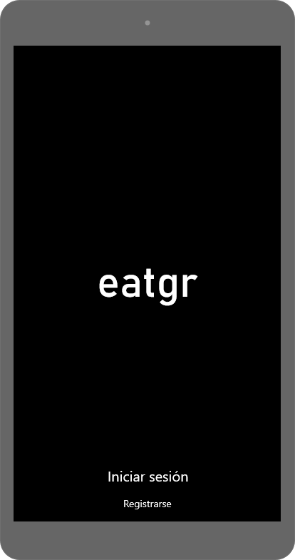

## Paso 3. Mi UX-Case Study (diseño)

 3.a Moodboard
-----

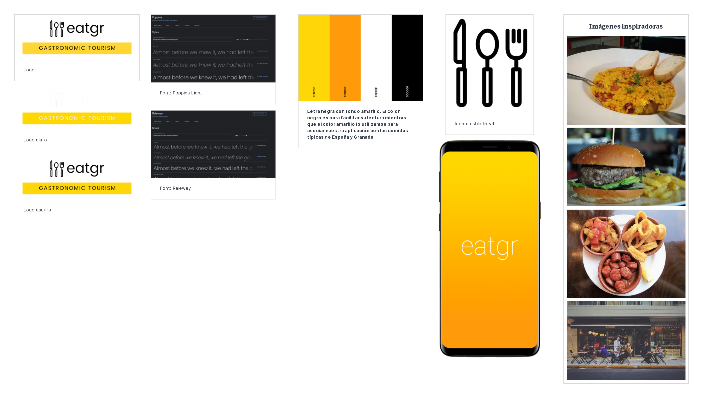

Link: https://app.milanote.com/1LFGhO13xy5c9i?p=0YxVQRveuQS

Comenzamos diseñando un logotipo para la aplicación centrándonos en la imagen y el color (letra negra con fondo amarillo). El color negro es para facilitar su lectura mientras que el color amarillo lo utilizamos para asociar nuestra aplicación con las comidas típicas de España y Granada. En cuanto a la fuente utilizamos  Poppins Light y Raleway debido a su facilidad de lectura y simplicidad. Como resultado conseguimos diseñar un logotivo sencillo y facil de interporetar

En cuanto a las imágenes decidimos utilizar imágenes de tapas para relacionarlo con las rutas culinarias en Granada. Para el logotipo además utilizamos una imagen con cubiertos para asociarlo con la gastronomía.

Para el logotipo usamos https://www.canva.com/ la cual es de pago, pero se puede usar gratis de forma limitada. Desafortunadamente, no se podía en SVG, y tuvimos que exportarlo en PNG, el cual si bien no tiene fondo, es un mapa de píxeles, y al ampliarlo o viceversa pierde calidad. Para usarla como cabecera, tendríamos que pasarlo a svg.

  3.b Landing Page
----

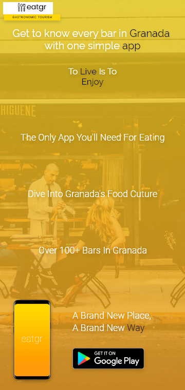

 3.c Guidelines
----

Para la guía de diseño, nos hemos basado en la simplicidad, la poca saturación, y consistencia. Hemos escogido colores cálidos para los elementos, y el blanco y el negro para las letras. Esto para relacionar nuestra aplicación con un estilo monocromático, fácil de asociar, y cálido para recordar al verano, ya que es la mayor época turistica del año. Unas fuentes comunes y minimalistas como son Ralleway y Roboto, ya que es algo familiar internacionalmente. Y lo mismo aplicado a la iconografía, un estilo lineal y fácilmente reconocible.

#### Patrones

###### FAQ
Para la sección de ayuda, pensamos en incluir una subsección con preguntas frecuentes. Ahí haríamos uso del patrón FAQ.
>>Use when users typically has the same concerns and questions about a service.
>>Use to collect answers to common questions from your support department or other type of feedback mechanism.

###### Slideshow
Útil para la sección de imágenes de un bar.
>>Use when you need to capture attention using multiple stories and minimize screen real estate.

###### Autocomplete
Es conveniente cuando los usuarios buscan un bar concreto.
>>Use to assist with ambiguity-issues, when an item can be entered in multiple ways

###### Search Filter
Una mejora con forme a la aplicación estudiada en la P1, y útil para términos de búsqueda amplios o ambiguos.
>>Use when the search results for a query are very numerous and reviewing them would be very time consuming.
>>Use when search results can be categorized into filters: the search must be contextual.

###### Testimonials
Para las reseñas de los bares.

###### Lazy Registration/Account Registration
Usado por usuarios nuevos que quieran usar la aplicación con o sin cuenta.

###### Module Tabs
Usado para filtrar simplemente las busquedas, o los locales/rutas en la página de inicio.

###### Home Link
Tenemos un home link en la barra desplazable de la izquierda.

  3.d Mockup
----

El enlace para interactuar con el Mockup en Adobe XD es este: https://xd.adobe.com/view/3af35b22-579f-4230-b4a2-839c88268657-6fa0/
También hay un archivo .xd en la carpeta P3.

 3.e ¿My UX-Case Study?
-----

Eatgr es una aplicación enfocada en el turismo culinario en Granada. En ella los usuarios podrán tanto acceder a la información sobre distintos bares granadinos, como planear una ruta o valorar dichos bares.

Para empezar, analizamos varias aplicaciones de turismo.

[Enlace](https://github.com/Oscarntnz/DIU21#-1a-competitive-analysis)

Y de ellas analizamos más en profundidad TurGranada, debido a que está centrada en turismo en Granada, y posee una versión App, a diferencia de las otras.

Lo siguente, fue crear 2 personajes ficticios:

Una persona mayor, con poca experiencia con la tecnología. Y una extranjera que no habla el idioma de la aplicación.

[Enlace](https://github.com/Oscarntnz/DIU21#-1b-persona)

Consideramos que esos dos personas (con poca experiencia con la tecnología y que no habla el idioma de la aplicación) nos podían presentar escenarios donde podríamos comprobar si la aplicación tuviera una interfaz lo suficientemente clara como para ser entendible para esos usuarios.

Dados estos personajes, creamos sus correspondientes Journey Maps, donde ambos viajan a Granada y usan la aplicación que analizamos.

[Enlace](https://github.com/Oscarntnz/DIU21#-1c-user-journey-map)

Para Antonio Jesús, decidimos que hiciera un viaje a Granada, ya que sería capaz de probar todas o la mayoría de funcionalidades de la aplicación, cosa que le podría causar problemas con la interfaz. Respecto a la segunda persona hemos decidido poner la barrera del idioma como inconveniente ya que creemos que es algo muy presente en la actualidad y tanto el anterior como este puede ayudarnos a diseñar una interfaz más enfocada a la facilidad de comprensión y uso por parte del usuario.

A parte de estos usuarios, hicimos un Usability Review donde puntuamos la aplicación y destacamos los apartados mejorables a groso modo. TurGranada obtuvo un 67.

Una vez planteados los problemas de la aplicación creamos un Feedback Capture Grid para analizar los does y los don’t, a parte de añadir posibles mejoras a añadir en nuestra aplicación.

[Enlace](https://github.com/Oscarntnz/DIU21#-2a-feedback-capture-grid--empathy-map--pov)

De la apliación analizada, los don’t destacados eran su desactualización, y su falta de funcionalidad.

A partir del punto anterior, extrajimos los puntos más relevantes e hicimos un Scope Canvas para aplicarlos en nuestra aplicación, a parte de añadir ciertos objetivos y metas a tener en cuenta.

[Enlace](https://github.com/Oscarntnz/DIU21#-2b-scopecanvas)

Una vez planteado el canvas, decidimos hacer una tabla recogiendo las acciones de nuestra futura aplicación, destacando las más usadas/importantes.

[Enlace](https://github.com/Oscarntnz/DIU21#-2b-tasks-analysis)

También creamos un sitemap para la navegación de la aplicación:

Los iconos que planteamos usar eran unos minimalistas, y conocidos por la mayoría de usuarios de cualquier dispositivo móvil. Esto sería útil para personajes como Antonio Jesús o Victoria, ya que ellos podrían aprovechar este diseño, ya sea por su claridad, o porque ya lo conocen de antes.

[Enlace](https://github.com/Oscarntnz/DIU21#-2c-ia-sitemap--labelling)

Seguidamente planteamos los bocetos iniciales de la aplicación. Estos para basarnos en ellos a la hora de hacer el diseño hi-fi, por lo cual no tienen mucho detalle, solo elementos que sustituiriamos en el paso siguiente.

[Enlace](https://github.com/Oscarntnz/DIU21#-2d-wireframes)

A partir de los bocetos diseñados anteriormente en la práctica 2 hemos diseñado una aplicación en adobe XD que cumpla con los objetivos principales de esta práctica.

Comenzamos diseñando un logotipo para la aplicación centrándonos en la imagen y el color (letra negra con fondo amarillo). El color negro es para facilitar su lectura mientras que el color amarillo lo utilizamos para asociar nuestra aplicación con las comidas típicas de España y Granada. En cuanto a la fuente utilizamos  Poppins Light y Raleway debido a su facilidad de lectura y simplicidad. Como resultado conseguimos diseñar un logotivo sencillo y facil de interporetar:

En cuanto a las imágenes decidimos utilizar imágenes de tapas para relacionarlo con las rutas culinarias en Granada. Para el logotipo además utilizamos una imagen con cubiertos para asociarlo con la gastronomía.

[Enlace](https://github.com/Oscarntnz/DIU21#-3a-moodboard)

Primero nos centramos en crear una base para lo que sería la aplicación , diseñando primero sus distintas secciones y el contenido de cada una de estas. A continuación decidimos que lo más importante sería centrarse en hacer la interfaz lo más simple posible evitando que estuviese saturada con distinta información. Por último enlazamos cada una de las ventanas para crear una sensación de unidad y funcionalidad de la aplicación.

[Enlace](https://github.com/Oscarntnz/DIU21#--3d-mockup)

## Paso 4. Evaluación 

 4.a Caso asignado
----

>>> Breve descripción del caso asignado con enlace a  su repositorio Github

 4.b User Testing
----

>>> Seleccione 4 personas ficticias. Exprese las ideas de posibles situaciones conflictivas de esa persona en las propuestas evaluadas. Asigne dos a Caso A y 2 al caso B
 

|    Usuarios   | Sexo/Edad| Ocupación   |  Exp.TIC    | Personalidad                      | Plataforma | TestA/B
| ------------- | -------- | ----------- | ----------- | --------------------------------  | ---------- | ----
|  Valdomero    | H / 67   |  Jubilado   | Baja        | Introvertido, miedoso             | App        | A 
| Carlos        | H / 35   |  Banquero   | Media       | Poca paciencia, adicto al trabajo | App        | A 
|    Evelyn     | M / 22   | Psicóloga   | Media       | Fiestera, sorprendida             | App        | B 
|    Pablo      | H / 36   | Camarógrafo | Alta\*      | Mal perdedor, testarudo           | App        | B

\*Antes de estudiar comunicación audiovisual, Pablo estudió informática.

. 4.c Cuestionario SUS
----

>>> Usaremos el **Cuestionario SUS** para valorar la satisfacción de cada usuario con el diseño (A/B) realizado. Para ello usamos la [hoja de cálculo](https://github.com/mgea/DIU19/blob/master/Cuestionario%20SUS%20DIU.xlsx) para calcular resultados sigiendo las pautas para usar la escala SUS e interpretar los resultados
http://usabilitygeek.com/how-to-use-the-system-usability-scale-sus-to-evaluate-the-usability-of-your-website/)
Para más información, consultar aquí sobre la [metodología SUS](https://cui.unige.ch/isi/icle-wiki/_media/ipm:test-suschapt.pdf)

>>> Adjuntar captura de imagen con los resultados + Valoración personal 

 4.d Usability Report
----

>> Añadir report de usabilidad para práctica B (la de los compañeros)

>>> Valoración personal 

## Paso 5. Evaluación de Accesibilidad  

  5.a Accesibility evaluation Report 
----

>>> Indica qué pretendes evaluar (de accesibilidad) sobre qué APP y qué resultados has obtenido 

>>> 5.a) Evaluación de la Accesibilidad (con simuladores o verificación de WACG) 
>>> 5.b) Uso de simuladores de accesibilidad 

>>> (uso de tabla de datos, indicar herramientas usadas) 

>>> 5.c Breve resumen del estudio de accesibilidad (de práctica 1) y puntos fuertes y de mejora de los criterios de accesibilidad de tu diseño propuesto en Práctica 4.

## Conclusión final / Valoración de las prácticas

>>> (90-150 palabras) Opinión del proceso de desarrollo de diseño siguiendo metodología UX y valoración (positiva /negativa) de los resultados obtenidos  

